# Canvisia - Architecture Diagrams

This document contains Mermaid diagrams showing the complete system architecture, data flows, and technology interactions.

---

## 1. High-Level System Architecture

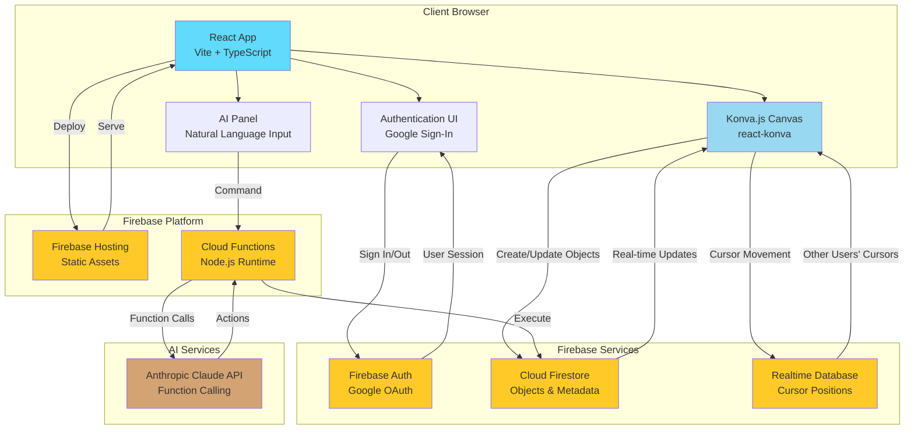

---

## 2. Frontend Component Architecture

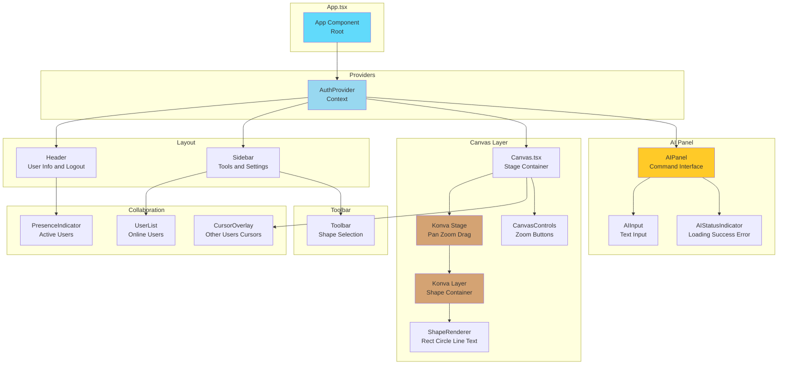

---

## 3. Data Flow: Authentication

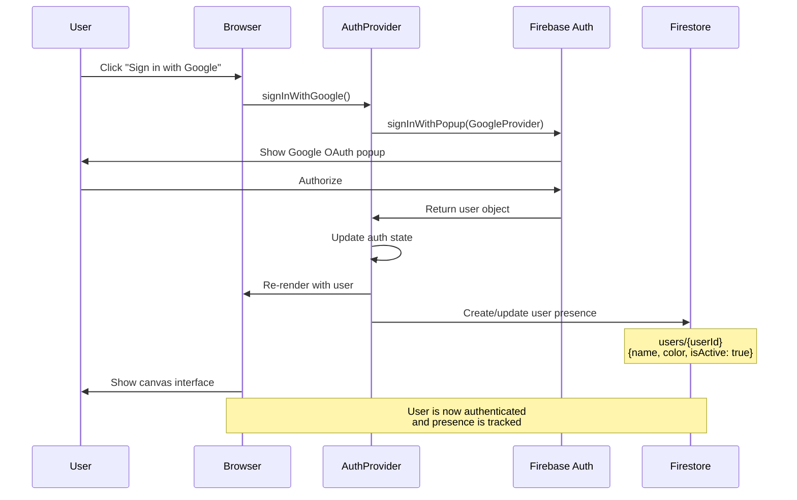

---

## 4. Data Flow: Real-Time Object Sync

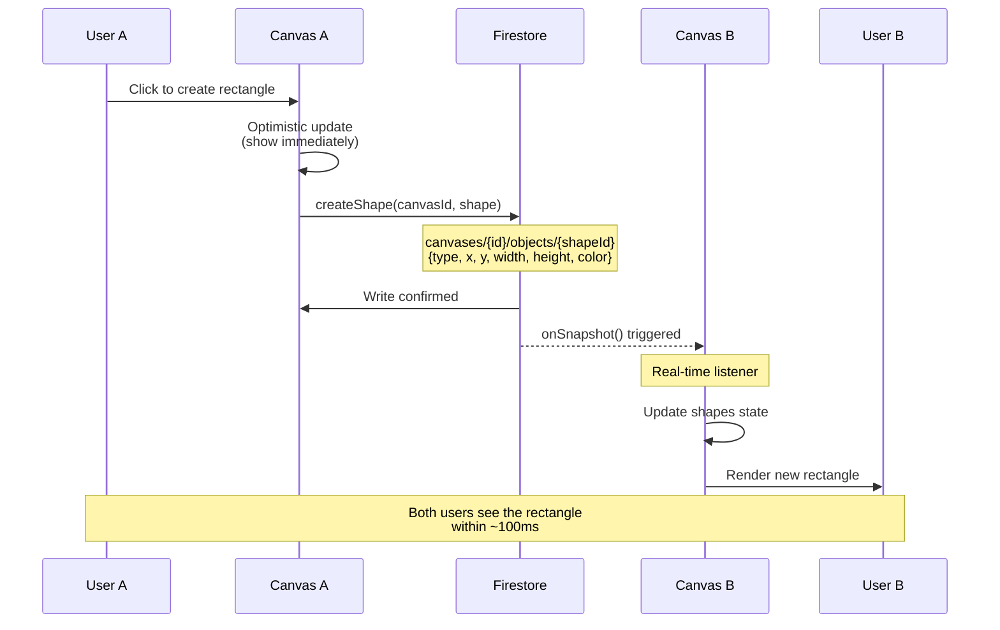

---

## 5. Data Flow: Real-Time Cursor Sync

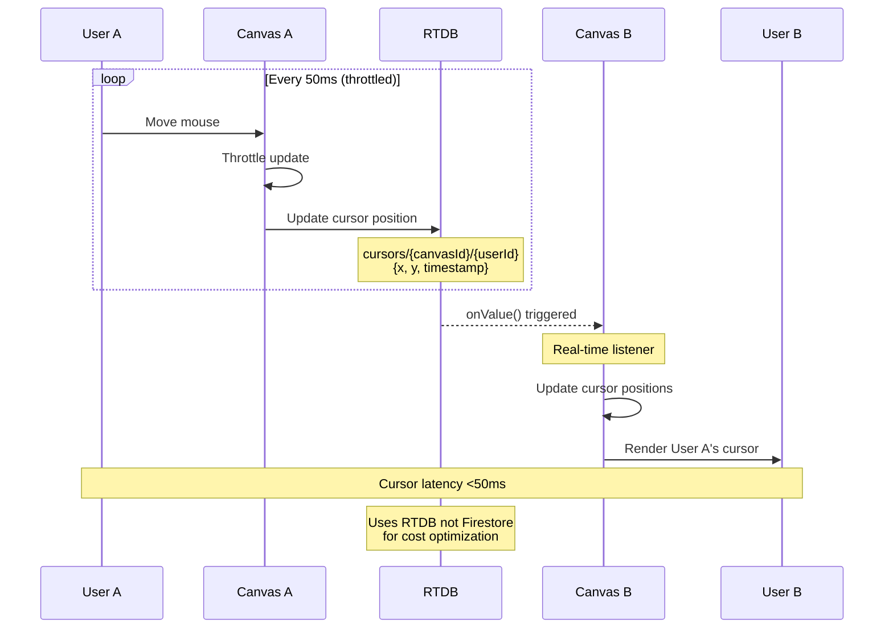

---

## 6. Data Flow: AI Command Execution (with Security)

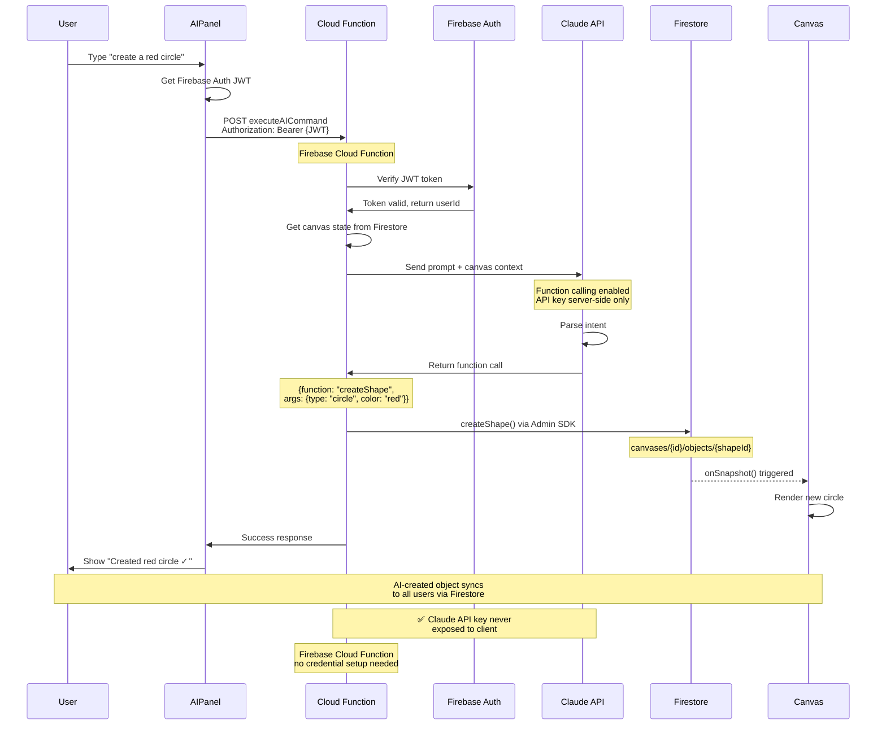

---

## 7. Firebase Data Structure

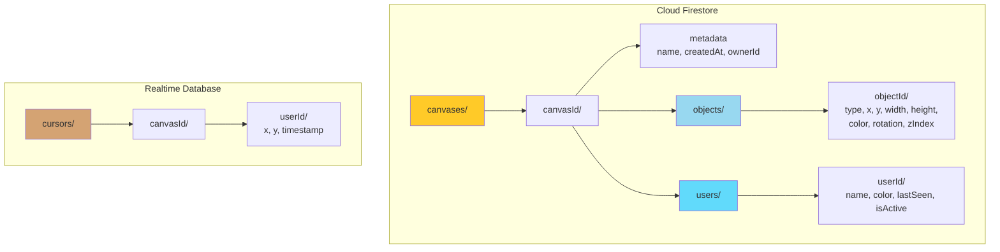

---

## 8. Service Layer Architecture

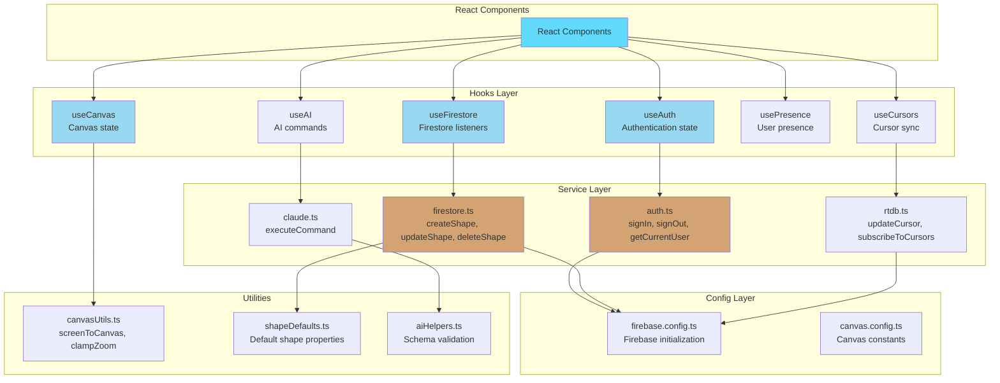

---

## 9. Type System Architecture

```mermaid
graph TB
    subgraph "Core Types"
        User["User<br/>{uid, email, displayName,<br/>photoURL, color}"]
        Canvas["Canvas<br/>{id, name, createdAt,<br/>ownerId}"]
        Shape["Shape (Base)<br/>{id, type, x, y,<br/>createdBy, updatedAt}"]
    end

    subgraph "Shape Types"
        Rectangle["Rectangle<br/>{...Shape, width, height,<br/>fill, stroke}"]
        Circle["Circle<br/>{...Shape, radius,<br/>fill, stroke}"]
        Line["Line<br/>{...Shape, x2, y2,<br/>stroke, strokeWidth}"]
        Text["Text<br/>{...Shape, text, fontSize,<br/>fontFamily, fill}"]
    end

    subgraph "State Types"
        AuthState["AuthState<br/>{user: User | null,<br/>loading: boolean}"]
        CanvasState["CanvasState<br/>{shapes: Shape[],<br/>selectedIds: string[]}"]
        CursorState["CursorState<br/>{userId: string,<br/>x: number, y: number}"]
        PresenceState["PresenceState<br/>{users: User[],<br/>onlineCount: number}"]
    end

    subgraph "AI Types"
        AICommand["AICommand<br/>{prompt: string,<br/>canvasId: string}"]
        AIFunction["AIFunctionCall<br/>{name: string,<br/>arguments: object}"]
        AIResponse["AIResponse<br/>{success: boolean,<br/>message: string}"]
    end

    Shape --> Rectangle
    Shape --> Circle
    Shape --> Line
    Shape --> Text

    User --> AuthState
    User --> PresenceState

    Shape --> CanvasState
    User --> CursorState

    AICommand --> AIFunction
    AIFunction --> AIResponse

    style Shape fill:#61dafb
    style User fill:#98d8f0
    style AICommand fill:#ffca28
```

---

## 10. Deployment & Infrastructure

```mermaid
graph TB
    subgraph "Development"
        Dev[Developer Machine<br/>npm run dev]
        DevEnv[.env.local<br/>Local secrets]
        Emulator[Firebase Emulators<br/>Auth, Firestore, RTDB, Functions]
    end

    subgraph "Version Control"
        GitHub[GitHub Repository<br/>github.com/reena96/Canvisia]
    end

    subgraph "Firebase Platform"
        Build[Build Process<br/>Vite build]
        Hosting[Firebase Hosting<br/>Global CDN]
        Functions[Cloud Functions<br/>Node.js runtime]
        FunctionsConfig[Functions Config<br/>Secrets via Firebase CLI]
    end

    subgraph "Production Firebase Services"
        ProdAuth[Firebase Auth<br/>Production]
        ProdFirestore[Cloud Firestore<br/>Production]
        ProdRTDB[Realtime Database<br/>Production]
    end

    subgraph "External Services"
        ProdClaude[Claude API<br/>Production]
        GoogleOAuth[Google OAuth<br/>Identity Provider]
    end

    subgraph "Users"
        Browser1[User Browser 1]
        Browser2[User Browser 2]
        Browser3[User Browser N]
    end

    Dev -->|git push| GitHub
    GitHub -->|firebase deploy| Build
    Build --> Hosting
    Build --> Functions

    Dev --> Emulator
    DevEnv --> Dev

    FunctionsConfig --> Functions

    Browser1 -->|HTTPS| Hosting
    Browser2 -->|HTTPS| Hosting
    Browser3 -->|HTTPS| Hosting

    Hosting -->|static assets| Browser1
    Browser1 -->|API calls| Functions
    Functions --> ProdClaude

    Browser1 --> ProdAuth
    Browser1 --> ProdFirestore
    Browser1 --> ProdRTDB
    Functions --> ProdAuth
    Functions --> ProdFirestore

    ProdAuth --> GoogleOAuth

    style Dev fill:#98d8f0
    style GitHub fill:#333333
    style Hosting fill:#ffca28
    style Functions fill:#ffca28
    style ProdAuth fill:#ffca28
    style ProdClaude fill:#d4a373
```

---

## 11. User Interaction Flow

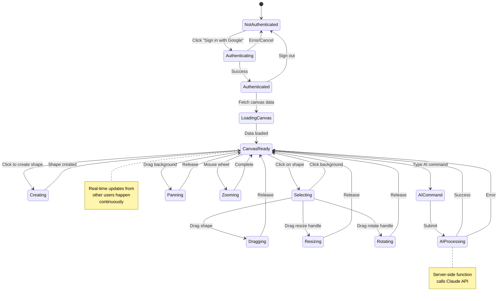

---

## 12. Performance Optimization Flow

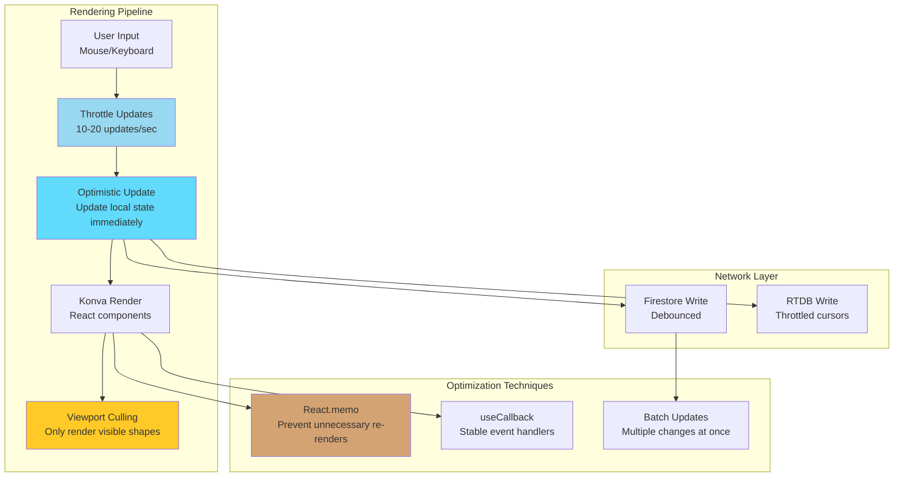

---

## 13. Error Handling & Recovery

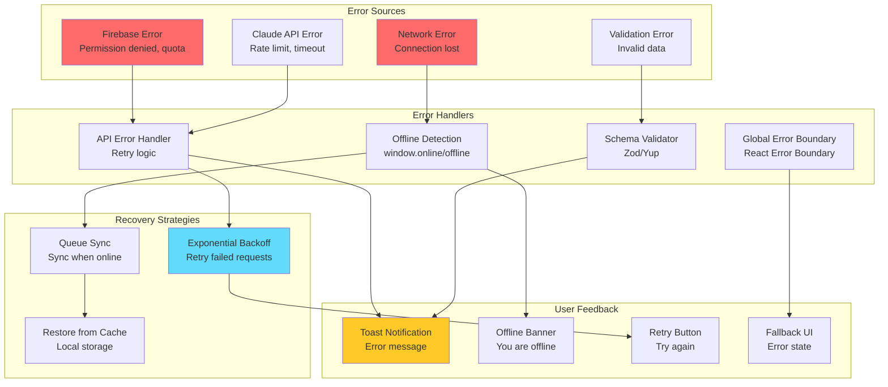

---

## 14. Security Architecture

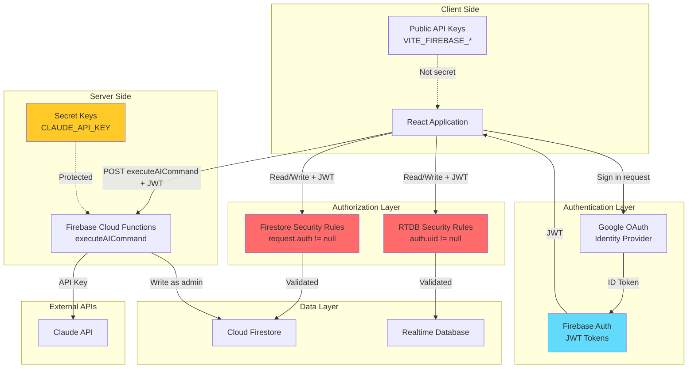

---

## 15. Technology Stack Summary

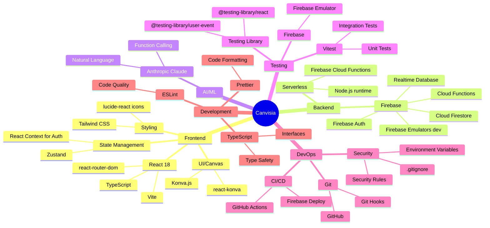

---

## Key Architecture Decisions

### 1. **Konva.js over PixiJS**
- **Reason:** Declarative React integration, built-in features (drag/drop, resize), saves 10-15 hours
- **Trade-off:** Slightly lower max object count (300-500 vs 1000+), but sufficient with viewport culling

### 2. **Hybrid Firebase Approach**
- **Firestore:** Objects, metadata (precise queries, automatic scaling)
- **RTDB:** Cursor positions (cost optimization for high-frequency updates)
- **Why:** Cursor updates at 20/sec would cost $3.89/hour with Firestore, nearly free with RTDB

### 3. **Server-Side AI Processing**
- **Pattern:** Client → Firebase Cloud Function → Claude API → Firestore
- **Why:** Protects Claude API key, enables rate limiting, adds validation layer, native Firebase integration

### 4. **Optimistic Updates**
- **Strategy:** Update local state immediately, sync to Firestore in background
- **Why:** 60 FPS user experience, feels instant even with network latency

### 5. **Firebase Emulator for Testing**
- **Why:** Integration tests use real Firebase behavior without mocks
- **Benefit:** Catches Firestore-specific issues (listeners, eventual consistency, rate limits)

---

## Performance Targets

| Metric | Target | Strategy |
|--------|--------|----------|
| Frame Rate | 60 FPS | Viewport culling, React.memo, throttling |
| Cursor Sync | <50ms | RTDB + throttling (20 updates/sec) |
| Object Sync | <100ms | Firestore + optimistic updates |
| Max Objects | 500+ | Viewport culling (only render visible) |
| Concurrent Users | 5+ | Firebase auto-scaling |
| AI Response | <2 sec | Claude function calling, caching |

---

## Next Steps

1. **PR #1:** Implement project setup with these patterns
2. **PR #2:** Set up Firebase services with data structure from Diagram 7
3. **PR #3:** Build Canvas with Konva.js as shown in Diagram 2
4. **PR #4-18:** Follow architecture patterns from these diagrams

---

**Generated:** 2025-10-13
**Repository:** https://github.com/reena96/Canvisia
**Based on:** CollabCanvas-PRD.md, TASK_LIST_WITH_TESTS.md
