# Canvisia AI Agent - Architecture Documentation

This document provides detailed architecture diagrams for the Canvisia AI Canvas Agent using Mermaid.

## Table of Contents
1. [System Overview](#system-overview)
2. [Component Architecture](#component-architecture)
3. [Sequence Diagram](#sequence-diagram)
4. [Data Model](#data-model)
5. [File Structure](#file-structure)

---

## System Overview

High-level flow of AI command processing:

```mermaid
flowchart TB
    User[👤 User] -->|Types command| Input[AI Command Input]
    Input -->|"Cmd+K or click"| Lock{Multi-User Lock}

    Lock -->|Lock acquired| Context[Context Builder]
    Lock -->|Locked by other user| Busy[❌ Show: AI busy with UserX]

    Context -->|Canvas state| Claude[🤖 Claude 3.5 Sonnet API]
    Claude -->|Tool calls| Executor[Command Executor]

    Executor -->|create/update| Firestore[(Firestore)]
    Firestore -->|Real-time sync| Canvas[🎨 Canvas Update]

    Canvas -->|Success| Feedback[✅ Toast: Created 4 shapes]
    Executor -->|Release lock| Lock

    style User fill:#e1f5ff
    style Claude fill:#fff4e6
    style Firestore fill:#e8f5e9
    style Canvas fill:#f3e5f5
```

---

## Component Architecture

### Frontend Components

### Service Layer Detail

---

## Sequence Diagram

Complete flow from user command to canvas update:

### Multi-User Lock Lifecycle

---

## Data Model

### Firestore Schema

### RTDB Lock Structure

---

## File Structure

---

## AI Tool Definitions

The 11 AI tools available to Claude:

### Tool Call Flow

---

## Technology Stack Diagram

---

## Performance & Optimization

---

## Security Considerations

---

## Error Handling Flow

---

## Future: Simulation Board Architecture

Preview of V3 Simulation features:

---

## Deployment Architecture

---

## Summary

This architecture provides:

✅ **Scalable** - Client-side AI can handle multiple users with lock coordination
✅ **Fast** - Sub-2s AI responses with optimistic updates
✅ **Extensible** - Metadata & connections support future simulation features
✅ **Collaborative** - Real-time sync with multi-user lock system
✅ **Testable** - Modular services enable unit and integration testing

**Next Steps:**
1. Implement PR #13 (AI Setup)
2. Add PR #14-17 (Commands)
3. Test multi-user scenarios
4. Plan V3 Simulation features
